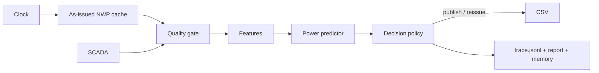

# Архитектура агента (LOC-22/23/24)

`Clock` и адаптеры данных обеспечивают доступность источника и схему. Числовой прогноз считает модель. Планировщик выбирает, публиковать ли результат, нужен ли новый выпуск и как объяснить решение. Выбор планировщика проверяется: нельзя использовать другой ран или заявить коррекцию, которой не было в числовом пути. Scripted-режим воспроизводим без API-ключа. В `anthropic` режиме Pydantic AI получает валидированный контекст и три read-only инструмента (`get_quality`, `get_available_run`, `get_revision_context`). Переход на более широкий tool loop после интеграции модели и SCADA.

| Решение | Данные | Scripted-правило | Поле trace | Статус |
|---|---|---|---|---|
| Quality gate | доступность NWP, полнота 48 ч | отклонить неполный горизонт | `decision`, `dq_report.json` | реализовано |
| Выбор источника | spread ансамбля | primary ecmwf_ifs; при ошибке остановить | `used_runs` | secondary pending LOC-15 |
| Bias correction | 7 дней фактов dev | не корректировать без истории | `corrections` | pending LOC-9/24 |
| Re-issue | новый опубликованный ран, divergence | создать новую версию при новом ране | `reissue_recommended`, `comparison.json` | реализовано |
| Устаревшая SCADA | `scada_age_h > 6` | прогноз без лаговых SCADA-фич | `dq_report.json` | pending LOC-8/12 |
| Отчёт и memory | прогноз и сравнение | сохранить заметку и причины | `report.md`, `memory.json` | реализовано |

Каждый шаг пишет `{step, tool, args, result_summary, decision, rationale, ms, tokens}`. Время выпуска, цикл NWP и контрольная сумма сырого кеша лежат в `inputs.json`. При ошибке шаг получает `abort`, выпуск — `status=failed`. Файлы различных запусков не перезаписываются.

Триггеры для LOC-24: новый опубликованный ран (`NWP_RUN`), среднее изменение ws100 >1.5 м/с (`DIVERGENCE_ALERT`), |z| остатка за шесть часов >2.5 (`RESIDUAL_ALERT`, только dev), дрейф bias 14 дней (`DRIFT`, только dev). Первые два имеют данные в test и могут вызывать re-issue; последние два ждут фактов и LOC-9. Февраль 2026 не имеет доступных актуалов, поэтому residual/drift в нём не заявляются.

ADR: для структурированного `IssueDecision`, `TestModel` и лимита запросов выбран Pydantic AI. Голый Anthropic SDK требует собственного цикла валидации/ретраев; LangGraph/CrewAI/Claude Agent SDK добавляют стоимость интеграции для этого короткого процесса. Текущие model ID и цены: [Claude models](https://platform.claude.com/docs/en/models/overview); 23.09.2026 Sonnet 5 `claude-sonnet-5` $2/$10 за 1M input/output tokens, Haiku 4.5 `claude-haiku-4-5-20251001` $1/$5. Цена 58 выпусков будет рассчитана по реальному usage после запуска с ключом; пока токенов и стоимости live-прогона нет.
