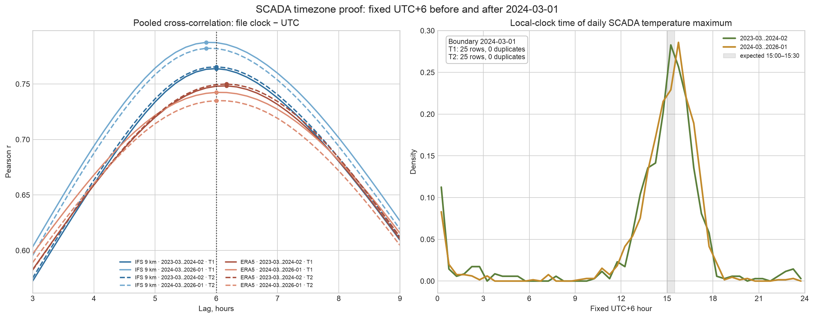

# Канонический SCADA-датасет (LOC-8)

## Результат

`data/processed/scada_hourly.parquet` — единственный вход SCADA для следующих спайков. В нём 50 784 строки: 25 392 последовательных UTC-часа × две турбины в long-формате. Период — `2023-03-10 18:00Z`…`2026-01-31 17:00Z`; ключ `(ts, turbine_id)` уникален.

| Поле | Тип / смысл |
|---|---|
| `ts` | tz-aware UTC, метка начала часа |
| `turbine_id` | `T1` или `T2` |
| `ws`, `p`, `temp` | средние 10-мин значений в часе; `p` не интерполируется |
| `n` | число исходных измерений мощности в часе, 0…6 |
| `range`, `frozen`, `outage`, `curve_resid`, `curtail`, `icing`, `t1_outage` | булевы флаги качества/режима; строки не удаляются |
| `is_clean` | готовая маска обучения: `n≥4` и ни одного флага |

Пустых часов (`n=0`) — 1 629 у T1 и 388 у T2. После правила `n<4 → NaN` невалидных таргетов 1 664 и 473 соответственно. Дубликатов нет.

## Определение часа и таймзоны

Исходная метка — фиксированный контроллерный UTC+6 на всём периоде. Преобразование строго `tz_localize('Etc/GMT-6').tz_convert('UTC')`; `Asia/Almaty` запрещён, поскольку после 1 марта 2024 он стал UTC+5, а часы SCADA не переводились.

По умолчанию `HOURLY_LABEL=left`: строка `10:00Z` — среднее полуинтервала `[10:00Z, 11:00Z)`, то есть исходных меток `10:00…10:50`. `HOURLY_LABEL=right` меняет только метку того же полуинтервала на `11:00Z`. Порог `MIN_SAMPLES_PER_HOUR=4` задан в `windagent/config.py`.



Pooled-кросс-корреляция 10-мин SCADA с UTC-референсами даёт пики 5.83–6.17 ч; во всех 8 комбинациях «IFS/ERA5 × T1/T2 × до/после 2024-03-01» выполняется `r@6h > r@5h`. Вторая панель показывает максимум температуры около 15:00–15:30 по фиксированным часам UTC+6. В окне `2024-02-29 22:00 → 2024-03-01 02:00` у каждой турбины ровно 25 строк, 0 дублей и все шаги равны 10 минутам.

## Семантика флагов

Флаги вычисляются сначала на исходном 10-мин ряду, затем агрегируются в час. Ошибки целостности сенсора (`range`, `frozen`) поднимаются при любом затронутом измерении; режимные флаги (`outage`, `curve_resid`, `curtail`, `icing`) — если условие выполняется хотя бы для половины имеющихся измерений часа. Это не позволяет одиночному выбросу назвать режимом весь час.

- `range`: `ws` вне `[0,30]` или `p` вне `[0,1]`.
- `frozen`: минимум три последовательных неизменных тройки `(ws,p,temp)`; известное окно T1 `2025-05-14 12:10 ≤ t < 15:30` также зафиксировано явно. Строка 15:30 уже меняется и не считается залипшей.
- `outage`: `p≤0.01` и `ws>5`.
- `curve_resid`: `p − 1/(1+exp(−0.705·(ws−7.89))) < −0.3`.
- `curtail`: `ws>12` и `p < 0.6·median(p)` в 0.5 м/с бине.
- `icing`: `temp<2°C` и `p<P10` своего 0.5 м/с бина минимум три последовательных 10-мин шага.
- `t1_outage`: T1, локальные даты 2024-05-18…2024-07-17 включительно. Флаг ставится и на пустых часах полной сетки.

Общие доли почасовых режимных флагов не превышают 2%; `outage` — 1.13% у T1 и 0.89% у T2. `t1_outage` (5.77% T1) — отдельная известная длинная потеря данных, а не автоматически найденная аномалия.

## Решение по дыре T1 2024-05…07

Таргет T1 не заменяется значениями T2: это нарушило бы контракт «таргет не интерполировать» и занизило бы ошибку обучения. Часы `t1_outage=True` исключаются из train через `is_clean`, но остаются в датасете и в оценочной временной сетке. T2 допустим только как явно помеченный proxy-признак или для farm-level аналитики; он не записывается в `p` T1. Причина, почему proxy всё же полезен: на общих часах корреляция мощности T1/T2 ≈0.97 и средняя абсолютная разница ≈0.027 почасово.

## Sanity кривой мощности

Без удаления режимов, на всех часах с `n≥4`:

| Турбина | Часов | MAE | R² |
|---|---:|---:|---:|
| T1 | 23 728 | 0.0314 | 0.9616 |
| T2 | 24 919 | 0.0280 | 0.9730 |

Это воспроизводит ожидаемый потолок по идеальному гондольному ветру: hourly MAE ≈0.031 и R² ≈0.96.

## Доли флагов по месяцам

Значения ниже — проценты от полной почасовой сетки каждой турбины. Месячные всплески допустимы; критерий ≤2% относится к общей доле каждого автоматически найденного флага на всём датасете.

| Month | Turbine | range | frozen | outage | curve_resid | curtail | icing |
|---|---:|---:|---:|---:|---:|---:|---:|
| 2023-03 | T1 | 0.00% | 0.00% | 0.39% | 0.20% | 0.00% | 0.00% |
| 2023-03 | T2 | 0.00% | 0.00% | 0.00% | 0.00% | 0.00% | 0.00% |
| 2023-04 | T1 | 0.00% | 0.00% | 2.36% | 1.39% | 0.42% | 0.00% |
| 2023-04 | T2 | 0.00% | 0.00% | 0.83% | 0.42% | 0.00% | 0.00% |
| 2023-05 | T1 | 0.00% | 0.00% | 0.00% | 0.00% | 0.00% | 0.00% |
| 2023-05 | T2 | 0.00% | 0.00% | 0.67% | 0.40% | 0.00% | 0.00% |
| 2023-06 | T1 | 0.00% | 0.00% | 0.42% | 0.42% | 0.00% | 0.00% |
| 2023-06 | T2 | 0.00% | 0.00% | 0.28% | 0.14% | 0.00% | 0.00% |
| 2023-07 | T1 | 0.00% | 0.00% | 6.45% | 5.11% | 0.13% | 0.00% |
| 2023-07 | T2 | 0.00% | 0.00% | 0.67% | 0.67% | 0.00% | 0.00% |
| 2023-08 | T1 | 0.00% | 0.00% | 0.27% | 0.00% | 0.00% | 0.00% |
| 2023-08 | T2 | 0.00% | 0.00% | 1.21% | 0.27% | 0.00% | 0.00% |
| 2023-09 | T1 | 0.00% | 0.00% | 0.00% | 0.00% | 0.00% | 0.00% |
| 2023-09 | T2 | 0.00% | 0.00% | 0.42% | 0.42% | 0.00% | 0.00% |
| 2023-10 | T1 | 0.00% | 0.00% | 0.27% | 0.27% | 0.00% | 0.00% |
| 2023-10 | T2 | 0.00% | 0.00% | 0.00% | 0.00% | 0.00% | 0.00% |
| 2023-11 | T1 | 0.00% | 0.00% | 7.92% | 6.39% | 2.36% | 0.00% |
| 2023-11 | T2 | 0.00% | 0.00% | 0.00% | 0.14% | 0.14% | 0.00% |
| 2023-12 | T1 | 0.00% | 0.00% | 0.67% | 0.13% | 0.00% | 2.96% |
| 2023-12 | T2 | 0.00% | 0.00% | 0.67% | 0.00% | 0.00% | 2.42% |
| 2024-01 | T1 | 0.00% | 0.00% | 0.13% | 0.00% | 0.00% | 3.49% |
| 2024-01 | T2 | 0.00% | 0.00% | 0.27% | 0.00% | 0.00% | 5.38% |
| 2024-02 | T1 | 0.00% | 0.00% | 0.29% | 0.00% | 0.00% | 7.90% |
| 2024-02 | T2 | 0.00% | 0.00% | 0.29% | 0.29% | 0.00% | 10.63% |
| 2024-03 | T1 | 0.00% | 0.00% | 0.13% | 0.27% | 0.13% | 0.54% |
| 2024-03 | T2 | 0.00% | 0.00% | 0.54% | 0.67% | 0.54% | 0.81% |
| 2024-04 | T1 | 0.00% | 0.00% | 0.28% | 0.28% | 0.00% | 0.00% |
| 2024-04 | T2 | 0.00% | 0.00% | 1.11% | 0.97% | 0.00% | 0.00% |
| 2024-05 | T1 | 0.00% | 0.00% | 0.13% | 0.13% | 0.00% | 0.00% |
| 2024-05 | T2 | 0.00% | 0.00% | 0.67% | 0.54% | 0.00% | 0.00% |
| 2024-06 | T1 | 0.00% | 0.00% | 0.14% | 0.69% | 0.14% | 0.00% |
| 2024-06 | T2 | 0.00% | 0.00% | 2.08% | 1.25% | 0.00% | 0.00% |
| 2024-07 | T1 | 0.00% | 0.00% | 0.67% | 1.34% | 0.40% | 0.00% |
| 2024-07 | T2 | 0.00% | 0.00% | 0.27% | 0.27% | 0.00% | 0.00% |
| 2024-08 | T1 | 0.00% | 0.00% | 1.21% | 0.94% | 0.27% | 0.00% |
| 2024-08 | T2 | 0.00% | 0.00% | 0.67% | 0.40% | 0.27% | 0.00% |
| 2024-09 | T1 | 0.00% | 0.00% | 0.28% | 0.28% | 0.00% | 0.00% |
| 2024-09 | T2 | 0.00% | 0.00% | 0.42% | 0.00% | 0.00% | 0.00% |
| 2024-10 | T1 | 0.00% | 0.00% | 0.67% | 0.40% | 0.00% | 0.00% |
| 2024-10 | T2 | 0.00% | 0.00% | 1.21% | 0.94% | 0.27% | 0.00% |
| 2024-11 | T1 | 0.00% | 0.00% | 0.14% | 0.28% | 0.00% | 0.14% |
| 2024-11 | T2 | 0.00% | 0.00% | 3.75% | 2.78% | 0.00% | 0.00% |
| 2024-12 | T1 | 0.00% | 0.00% | 0.54% | 0.40% | 0.00% | 3.09% |
| 2024-12 | T2 | 0.00% | 0.00% | 0.54% | 0.27% | 0.00% | 3.90% |
| 2025-01 | T1 | 0.00% | 0.00% | 1.08% | 0.40% | 0.00% | 7.53% |
| 2025-01 | T2 | 0.00% | 0.00% | 1.48% | 0.54% | 0.00% | 9.27% |
| 2025-02 | T1 | 0.00% | 0.00% | 1.19% | 0.15% | 0.00% | 3.12% |
| 2025-02 | T2 | 0.00% | 0.00% | 4.61% | 4.46% | 0.15% | 6.70% |
| 2025-03 | T1 | 0.00% | 0.00% | 0.27% | 0.40% | 0.13% | 0.13% |
| 2025-03 | T2 | 0.00% | 0.00% | 1.75% | 1.21% | 0.13% | 0.13% |
| 2025-04 | T1 | 0.00% | 0.00% | 0.83% | 0.83% | 0.00% | 0.00% |
| 2025-04 | T2 | 0.00% | 0.00% | 0.56% | 0.69% | 0.14% | 0.00% |
| 2025-05 | T1 | 0.00% | 0.54% | 5.78% | 5.51% | 0.67% | 0.00% |
| 2025-05 | T2 | 0.00% | 0.00% | 0.27% | 0.13% | 0.00% | 0.00% |
| 2025-06 | T1 | 0.00% | 0.00% | 3.19% | 2.92% | 0.14% | 0.00% |
| 2025-06 | T2 | 0.00% | 0.00% | 0.69% | 0.00% | 0.00% | 0.00% |
| 2025-07 | T1 | 0.00% | 0.00% | 0.94% | 0.27% | 0.00% | 0.00% |
| 2025-07 | T2 | 0.00% | 0.00% | 0.54% | 0.00% | 0.00% | 0.00% |
| 2025-08 | T1 | 0.00% | 0.00% | 0.40% | 0.13% | 0.00% | 0.00% |
| 2025-08 | T2 | 0.00% | 0.00% | 0.13% | 0.13% | 0.00% | 0.00% |
| 2025-09 | T1 | 0.00% | 0.00% | 0.28% | 0.28% | 0.00% | 0.00% |
| 2025-09 | T2 | 0.00% | 0.00% | 0.28% | 0.28% | 0.00% | 0.00% |
| 2025-10 | T1 | 0.00% | 0.00% | 0.13% | 0.27% | 0.00% | 0.00% |
| 2025-10 | T2 | 0.00% | 0.00% | 0.67% | 0.54% | 0.00% | 0.00% |
| 2025-11 | T1 | 0.00% | 0.00% | 0.42% | 0.14% | 0.00% | 0.14% |
| 2025-11 | T2 | 0.00% | 0.00% | 0.14% | 0.00% | 0.00% | 0.14% |
| 2025-12 | T1 | 0.00% | 0.00% | 0.13% | 0.27% | 0.00% | 6.05% |
| 2025-12 | T2 | 0.00% | 0.00% | 1.75% | 1.21% | 0.67% | 7.66% |
| 2026-01 | T1 | 0.00% | 0.00% | 1.36% | 0.27% | 0.00% | 8.13% |
| 2026-01 | T2 | 0.00% | 0.00% | 1.76% | 0.68% | 0.00% | 11.38% |

## Воспроизведение

```bash
python -m windagent.data.scada
python scripts/tz_check.py          # использует закоммиченные референсы
pytest -q
```

`scripts/tz_check.py --fetch` обновляет IFS/ERA5 через Open-Meteo. Референсы предназначены только для доказательства таймзоны и не являются as-issued признаками тестового периода.
