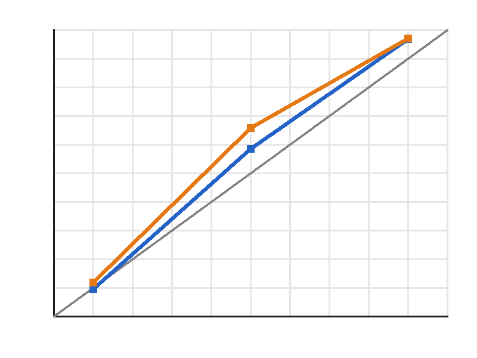

# LOC-11 — LightGBM P10/P50/P90

Three LightGBM quantile models use the exact LOC-10 feature schema and holdout split. A fourth L2 model provides the conditional mean for RMSE-oriented submissions. Quantiles are clipped to [0, 1] and sorted row-wise to prevent crossing.

| Window | Turbine | Point | n | MAE | RMSE | P10–P90 coverage | Mean pinball |
|---|---|---|---:|---:|---:|---:|---:|
| feb2025 | T1 | mean | 1,332 | 0.175 | 0.233 | 89.0% | 0.0479 |
| feb2025 | T1 | median | 1,332 | 0.157 | 0.234 | 89.0% | 0.0479 |
| feb2025 | T2 | mean | 1,332 | 0.203 | 0.281 | 85.7% | 0.0581 |
| feb2025 | T2 | median | 1,332 | 0.185 | 0.285 | 85.7% | 0.0581 |
| jan2026 | T1 | mean | 1,464 | 0.187 | 0.251 | 85.7% | 0.0528 |
| jan2026 | T1 | median | 1,464 | 0.175 | 0.257 | 85.7% | 0.0528 |
| jan2026 | T2 | mean | 1,464 | 0.192 | 0.259 | 84.7% | 0.0543 |
| jan2026 | T2 | median | 1,464 | 0.179 | 0.264 | 84.7% | 0.0543 |

## Reliability



Gray is perfect calibration, blue is February 2025 and orange is January 2026. The x-axis is the nominal quantile and the y-axis is the observed fraction below it.

| Window | Quantile | Nominal | Observed | n |
|---|---|---:|---:|---:|
| feb2025 | P10 | 10% | 9.6% | 2,664 |
| feb2025 | P50 | 50% | 58.6% | 2,664 |
| feb2025 | P90 | 90% | 96.9% | 2,664 |
| jan2026 | P10 | 10% | 11.9% | 2,928 |
| jan2026 | P50 | 50% | 65.8% | 2,928 |
| jan2026 | P90 | 90% | 97.1% | 2,928 |

## Decision

Use `POINT_ESTIMATE=median` for MAE and `POINT_ESTIMATE=mean` for RMSE. Serving always returns P10/P50/P90; `cost` is accepted as a configuration mode and currently falls back to P50 until LOC-31 supplies imbalance coefficients.

## Reproduce

```bash
uv run --frozen python -m windagent.model.quantiles
```

The command is offline and reads only committed Parquet inputs.
